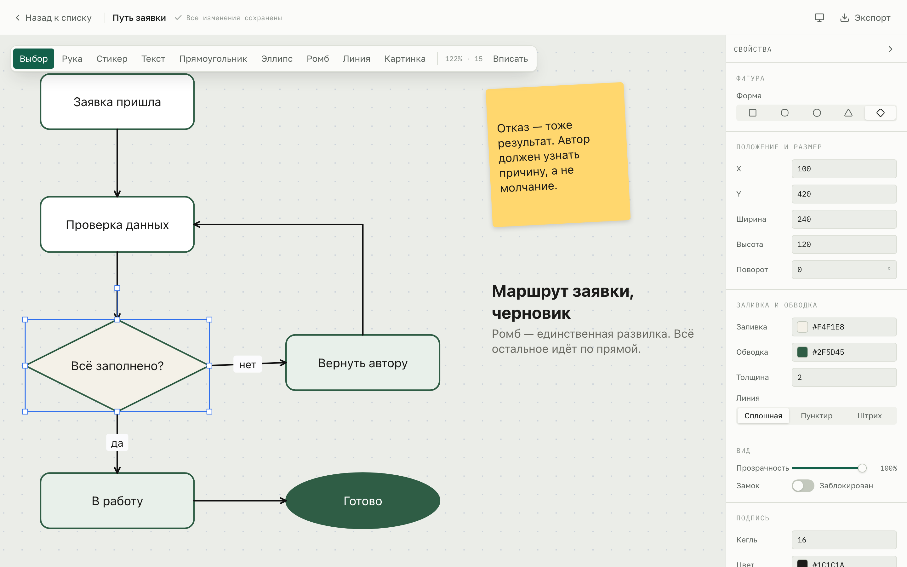

# Prostor

**Бесконечная доска для диаграмм, заметок и изображений.** Домашнее задание №2.

Открываете приложение — создаёте проект — получаете свободный холст без краёв.
На нём ставятся фигуры с подписями внутри, текстовые блоки, стикеры и картинки;
фигуры соединяются линиями, которые держатся за объект и переезжают вместе с ним.
Всё редактируется в панели свойств справа, отменяется по `Cmd+Z` и сохраняется
само. Без аккаунта данные не покидают браузер — лежат в IndexedDB того
браузера, где вы работаете; с аккаунтом доски и картинки синхронизируются
через Supabase, и появляется публичная ссылка на чтение. Как поднять свой
Supabase-проект — [docs/cloud-setup.md](docs/cloud-setup.md).



## Запуск с нуля

Нужен только Node.js — проверялось на 24.16, npm 11.13. Больше ничего ставить
не нужно: ни базы, ни ключей, ни файла окружения.

```bash
git clone https://github.com/kaydo228/AvailableCanvas.git
```

```bash
cd AvailableCanvas
```

```bash
npm install
```

```bash
npm run dev
```

Откройте <http://localhost:5173>. Если порт занят, Vite сам возьмёт следующий
и напишет в терминале, какой именно.

Дальше: нажмите «Создать проект», введите имя, нажмите «Создать» — и вы сразу
на холсте. Клавиша `?` показывает все горячие клавиши.

Инструкция проверена на чистом клоне в пустой папке: `npm install`,
`npm run build` и `npm run dev` проходят подряд без единой ручной правки.

### Остальные команды

| Команда | Что делает |
|---|---|
| `npm run dev` | Vite на <http://localhost:5173> |
| `npm run build` | проверка типов и сборка в `dist/` |
| `npm test` | Vitest, один прогон |
| `npm run e2e` | Playwright, сам поднимает dev-сервер |
| `npm run check` | единая проверка для CI: типы, Biome, unit- и e2e-регрессии |
| `npm run perf` | замер NFR-01 отдельно, в один поток: рядом с параллельными сценариями он мерил бы машину, а не доску |
| `npm run docs:pdf` | пересобрать `docs/REPORT.pdf` из `REPORT.md` |
| `npm run typecheck` | только типы |
| `npm run lint` | Biome — линтер и форматтер сразу |

## Что умеет

Нумерация — по функциональным требованиям из [docs/SPEC.md](docs/SPEC.md).

| | Что работает |
|---|---|
| FR-01 Проекты | пустое состояние с кнопкой вместо серого списка, сетка карточек с миниатюрой холста, переименование, дублирование, удаление с подтверждением. Маршруты `/` и `/p/:projectId`; несуществующий проект показывает понятное состояние, перезагрузка на холсте открывает тот же проект в том же положении вида |
| FR-02 Холст | бесконечное полотно, панорамирование колесом, `Space` с перетаскиванием и средней кнопкой, зум `Cmd`+колесо **к позиции курсора**, диапазон 10–400 %, точечная сетка с плотностью по зуму; меню масштаба с 50/100/200 %, «Вписать всё», «Вписать выделенное» и сбросом |
| FR-03 Фигуры | семь форм: прямоугольник, скруглённый, эллипс, треугольник, ромб, шестиугольник, семиугольник — пять из ТЗ и две сверх него. В панели инструментов пять, остальные переключаются в панели свойств. Правильные многоугольники строятся общим генератором `regularPolygon`, а не отдельной формулой на форму. Создание протяжкой и одиночным кликом, `Shift` держит пропорции. **У любой фигуры есть подпись внутри** по двойному клику — без неё это не диаграммы |
| FR-04 Текст | блок по клику или протяжке, правка по месту, пустой блок при потере фокуса удаляется сам; значение ограничено 10 000 символами |
| FR-05 Стикеры | квадрат с палитрой из шести цветов, кегль подбирается под длину текста; значение ограничено 10 000 символами |
| FR-06 Картинки | тремя способами: кнопка, перетаскивание файла на холст, `Cmd+V`. Файлы лежат блобами в IndexedDB, в документе — только ссылка. Лимит 10 МБ, чужой формат отбивается с внятной причиной |
| FR-07 Соединители | линия между фигурами с привязкой к якорям, прокладка прямой, ломаной и кривой Безье, стрелки, подпись на середине. Удалили фигуру — концы отвязываются в координаты, а не повисают в никуда |
| FR-08 Выделение | клик, `Shift`+клик, рамка протяжкой, трансформер с правилом пропорций (у картинки они держатся по умолчанию, `Shift` отпускает), групповое перетаскивание, порядок слоёв, поворот и изменение размера — в том числе растяжение группы вместе с содержимым |
| FR-09 Панель свойств | свои поля у каждого типа узла; при разнотипном выделении остаются только общие; цвет применяется мгновенно, пока тянете ползунок; когда ничего не выделено — свойства холста |
| FR-10 История | `Cmd+Z` и `Shift+Cmd+Z`, глубина 50. Панорамирование в историю не попадает, перетаскивание объекта — один шаг, а не сорок кадров, набор текста — один шаг от фокуса до `blur` |
| FR-11 Сохранение | автосохранение с дебаунсом 500 мс без мигающего индикатора загрузки, положение вида переживает перезагрузку. С аккаунтом остаются только полезные состояния: ошибка или «Сохранено только здесь», когда доска цела в браузере, но ещё не уехала на сервер. Сохранение доски на 1000 узлов не блокирует ввод |
| FR-12 Экспорт | PNG всей доски и только выделенного, 1× и 2×, с границами прямых, ломаных и кривых соединителей; JSON всего документа с картинками внутри, импорт обратно новым проектом с проверкой через zod |
| FR-13 Группы | `Cmd+G` собирает, `Cmd+Shift+G` распускает. Группа — контейнер без хит-теста: клик по участнику разворачивается в выделение всей группы, рамка мышь не ловит. `Delete` уносит содержимое, стрелки двигают состав, а не одну рамку |
| Дублирование | `Cmd+D` — копия группы целиком, с перевязкой связей: коннекторы внутри копии смотрят на копии, а не на оригиналы |
| Буфер обмена | `Cmd+C` и `Cmd+V` — те же правила перевязки, что у `Cmd+D`, но через **системный** буфер: работает между досками и вкладками, повторная вставка каскадом. Своего буфера в памяти нет намеренно — он молча устаревал бы после копирования чего-нибудь в другой программе |
| Целостность данных | валидатор проверяет все пять инвариантов, двустороннюю связь `groupId ↔ children`, циклы и производные рамки групп; `features/persistence/repair.ts` чинит документ **на обоих входах** — при импорте файла и при чтении из IndexedDB, сообщая об усечении текста и восстанавливая рамки |
| Синхронизация и совместная работа *(сверх ТЗ)* | вход по почте и паролю (Supabase Auth), приглашения по email и роли: владелец, редактор, зритель. Редактор меняет доску, зритель может только смотреть и экспортировать. Сохранённые изменения приходят открытым участникам через Supabase Realtime без перезагрузки; отзыв доступа закрывает проект. Публичная ссылка остаётся отдельным анонимным режимом только для чтения |
| 6.2, 6.3 | горячие клавиши на кодах клавиш (работают на русской раскладке), справка по `?`, двухступенчатый `Esc`. Пока правится текст, все глобальные клавиши выключены. Нереализованных строк в справке не осталось |
| Сверх ТЗ | тёмная тема на смысловых токенах; шестая и седьмая формы фигур |

## Чего не умеет

Честно, потому что это оценивается отдельно.

| Не сделано | Почему |
|---|---|
| Рисование карандашом | тип `DrawNode` в модели есть, инструмента и рендерера нет — `NodesLayer` знает семь типов, `draw` среди них отсутствует. По ТЗ это COULD, брали последним и не дошли |
| Вход внутрь группы двойным щелчком | выделяется всегда верхняя группа. Осознанно отложено при реализации групп, записано в [docs/CONTRACT-REQUESTS.md](docs/CONTRACT-REQUESTS.md) |
| Поля геометрии в инспекторе, когда в выделении есть группа | спрятаны намеренно: `updateNodes` ставит значение абсолютно и всем сразу, и «X = 100» свалило бы содержимое группы в одну точку. Нужно новое действие стора — сдвиг на дельту, — а это правка общего шва, делается вдвоём |
| Обход третьих фигур ломаной линией | это `A*`-роутинг, он вне ТЗ. Ограничение осознанное |
| Мобильная вёрстка и тач-жесты | вынесено за границы в ТЗ, п. 1.2 |
| Одновременное бесконфликтное редактирование | Realtime передаёт сохранённое состояние всей доски по правилу «последняя принятая запись побеждает». Это не CRDT: если два редактора одновременно меняют один объект, более позднее сохранение заменит доску целиком. Чужих курсоров, выделений и Presence пока нет |
| Крупное обновление Vitest до v4 | намеренно отложено: стабилизационный цикл не меняет версию тестового раннера и не добавляет зависимостей |
| Публичная доска только читается, но не только смотрится | узлы на ней всё равно перетаскиваются мышью — `draggable` живёт в зоне A, и правка сюда не заходит; сдвиг пропадает при закрытии вкладки, но пока вкладка открыта, выглядит так, будто что-то сохранилось. Запрос на флаг `readOnly` в сторе записан в [docs/CONTRACT-REQUESTS.md](docs/CONTRACT-REQUESTS.md) (2026-09-03), пока без ответа |
| Бесплатный проект Supabase встаёт на паузу | после недели без единого запроса, и сам из паузы **не выходит**: владелец восстанавливает проект вручную из панели управления Supabase, это занимает минуты. Пока проект на паузе, синхронизация просто не работает — доски целы в браузере, но никуда не едут и ниоткуда не приезжают. Лечится ежедневным пингом, чтобы до паузы не доводить; разбудить уснувший проект пинг не может. Инструкция и пример GitHub Action — в [docs/cloud-setup.md](docs/cloud-setup.md) |
| Удаление доски без связи снесёт её только здесь | локально доска удаляется сразу, а строку на сервере удалить нечем. Про отказ говорит тост, но повторить удаление негде: доска уже исчезла из списка, а при следующем входе вернётся скачиванием — и удалять её придётся ещё раз, уже со связью. Очередь отложенных удалений не заведена: она требует надгробий (запись «эта доска удалена», переживающая удаление самой доски) и их согласования в правиле слияния — это отдельная задача, а не строчка в починке |
| Картинки на публичной доске не грузятся постороннему | `loadPublicBoard` (`features/cloud/model/share.ts`) нарочно не отдаёт `owner` анониму — это та самая закрытая утечка (см. шапку `features/cloud/model/images.ts`), а `downloadImage` умеет читать файл только по пути `owner/blobId`. `PublicBoardScreen` при этом ни разу не зовёт `connectRemoteImages`, и звать было бы нечем: единственный фолбэк ставит `useCloudSyncOnLogin` по userId **зрителя**, а не владельца доски, так что даже вошедший зритель качал бы файл из своей же папки в хранилище, а не из чужой. В итоге `ImageView` навсегда остаётся на плейсхолдере — картинка приезжает, только если тот же `blobId` уже случайно лежит в локальной IndexedDB зрителя. Починка — не пара строк: нужен отдельный публичный путь к файлу (подписанный URL с коротким сроком жизни или серверная функция-прокси), который не возвращает владельца в открытом виде — иначе дыра, которую закрывал этот же раунд правок, открывается заново |

**Что было в этой таблице неделю и закрыто в последний день:** группировка
`Cmd+G`, дублирование `Cmd+D`, поворот и изменение размера через стор,
реализация проверок инвариантов (те самые «13 намеренно красных тестов»).
Все четыре пункта сделаны и влиты в `main` 27 августа — разбор, включая
цену такой отсрочки, в [REPORT.md](REPORT.md).

Все **672 юнит-теста** и **98 сценариев Playwright** — зелёные. `npm run check`
запускает типы, Biome, unit- и e2e-тесты в GitHub Actions на `main` и pull request;
замер производительности остаётся отдельным обязательным прогоном `npm run perf`.

## Кто что делал

Двое фронтендеров, два непересекающихся слоя. Границу зафиксировали в первый
день: `src/shared/types/document.ts` (модель данных) и `src/shared/store/`
(действия над документом) — общий шов, меняется только вдвоём. Всё остальное
каждый правит только у себя.

| Кто | Зона | Что сделал |
|---|---|---|
| **roman_restov** | A — «Движок»: всё, что рисуется на холсте (`features/canvas/**`) | бесконечный холст, вьюпорт и сетка; типы узлов — фигуры, текст, стикеры, картинки; выделение, рамка, трансформер, порядок слоёв; соединители целиком — привязка к якорям, три прокладки, подписи, отвязка при удалении; скилл `canvas-node-type`; ночной прогон по соединителям |
| **alfis** | B — «Оболочка»: всё, что вокруг холста (`features/{projects,inspector,history,persistence,export,shortcuts}`, `shared/ui`) | обвязка проекта — Biome, Vitest, Playwright, хуки; экран проектов, маршруты и диалоги; хранение в IndexedDB и автосохранение; панель свойств; горячие клавиши и справка; история отмен; экспорт и импорт; оформление и тёмная тема; скилл `feature-slice`; сквозные сценарии |

Каждый вёл свои сессии; дословный журнал промптов — в
[`sessions/`](sessions/), по папке на человека, его пишет хук
`.claude/hooks/log-prompt.sh`.

**Про распределение коммитов, чтобы вопрос не возник.** `git shortlog -sne`
даёт около 80 коммитов у `roman_restov`, 17 у `alfis`, 3 у `kaydo`, и это
не пропорция вклада. Зона B делалась на ветке `setup/tooling` крупными
блоками — там меньше коммитов, но в них экран проектов, хранение, инспектор,
история, экспорт и вся обвязка. Плюс перекос в пользу первой цифры: сведение
двух разъехавшихся веток 27 августа, все доработки последнего дня (группы,
дублирование, поворот, размер, инварианты, worktrees, изоляция, инъекция,
локальные шрифты, разделение бандла) и повторный прогон ломателя F-3
писались с одной машины. Журнал сессий у `alfis` — по 25, 26 и 28 августа
(последний файл — прогон `pre-merge.md` по зоне B).

Запросы через границу зон — в
[docs/CONTRACT-REQUESTS.md](docs/CONTRACT-REQUESTS.md): туда пишется всё,
что требует чужой зоны, вместо того чтобы лезть в неё руками.

## Документы

| Файл | Что внутри |
|---|---|
| [docs/SPEC.md](docs/SPEC.md) | техническое задание |
| [docs/SPEC.pdf](docs/SPEC.pdf) | оно же в вёрстке |
| [REPORT.md](REPORT.md) | отчёт по пунктам задания, включая то, что не получилось |
| [docs/REPORT.pdf](docs/REPORT.pdf) | он же в вёрстке: обложка, оглавление, резюме на полстраницы. Пересобирается `npm run docs:pdf` |
| [docs/DECISIONS.md](docs/DECISIONS.md) | журнал решений и отвергнутых вариантов |
| [docs/CONTRACT-REQUESTS.md](docs/CONTRACT-REQUESTS.md) | запросы через границу зон |
| [docs/TOOLING.md](docs/TOOLING.md) | библиотеки, скиллы, хуки |
| [docs/TOOLS-INDEX.md](docs/TOOLS-INDEX.md) | индекс кодовой базы: замер до и после, разведка по кандидатам |
| [docs/PLAN-FINAL.md](docs/PLAN-FINAL.md) | доработки после оценки: шесть задач, из них F-1, F-3, F-4, F-5 закрыты, F-2 и F-6 — нет |
| [docs/PROMPTS-FINAL.md](docs/PROMPTS-FINAL.md) | промпты под каждую задачу из этого плана |
| [docs/PROMPTS-A.md](docs/PROMPTS-A.md), [-B](docs/PROMPTS-B.md), [-SHARED](docs/PROMPTS-SHARED.md) | библиотека промптов, с которой шли в работу: по блоку на день. Чем это отличается от `sessions/` — там то, что реально отправили, здесь то, что планировали отправить |
| [docs/nightly/](docs/nightly/) | пофайловые следы ночных прогонов: `connectors/` — прогон по соединителям, `breaker/` — агент-ломатель холста (F-3), `shell/` — план починки оболочки |
| [workflows/](workflows/) | повторяемые процедуры: чеклист перед merge, ночной прогон |
| [CLAUDE.md](CLAUDE.md) | правила репозитория для агента |
